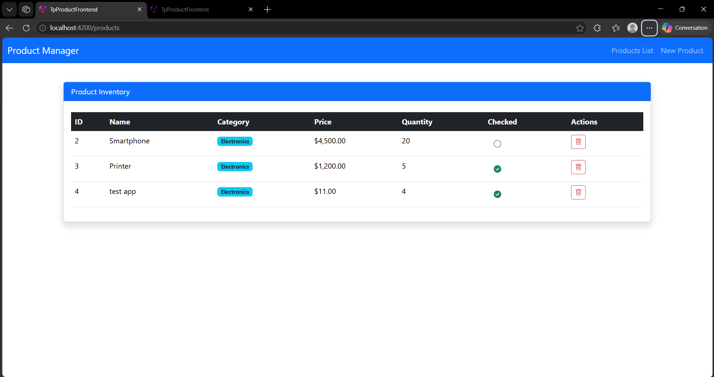
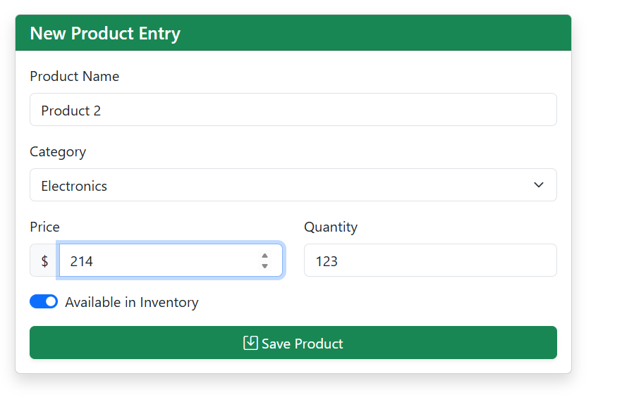

# Système de Gestion d'Inventaire - Frontend Angular

## Description

Ce projet est une interface utilisateur moderne développée avec **Angular 17+** (mode Standalone) pour la gestion d'un catalogue de produits et de catégories. Il communique de manière asynchrone avec une API Spring Boot pour offrir une expérience utilisateur fluide et réactive (SPA - Single Page Application).

## Captures d'écran
### 1. Dashboard et Liste des Produits


_Aperçu du tableau dynamique avec gestion des états (Checked/Unchecked) et suppression en temps réel._

### 2. Formulaire d'Ajout (Reactive Forms)


_Interface de création avec validation des champs et sélection de catégorie liée au backend._

## Architecture Technique

L'application suit une architecture modulaire et découplée:

- **Composants Standalone** : Utilisation des nouvelles fonctionnalités d'Angular pour une structure plus légère sans NgModules.
- **Service Layer** : Centralisation des appels HTTP via `HttpClient` et gestion des flux de données avec **RxJS**.
- **Control Flow** : Utilisation de la nouvelle syntaxe `@for` et `@if` pour un rendu performant.
- **Modèles Type-Safe** : Interfaces TypeScript rigoureuses pour garantir l'intégrité des données backend.

## Stack Technique

- **Angular 17+** : Framework principal..
- **Bootstrap 5 & Icons** : Pour un design responsive et professionnel.
- **RxJS** : Programmation réactive pour les appels API.
- **Zone.js** : Gestion de la détection de changement.

## Fonctionnalités Clés

1. **Affichage Dynamique** : Tableau triable affichant les produits et leurs catégories respectives.
2. **Gestion d'État** : Mise à jour instantanée de l'état "Checked" via un toggle asynchrone.
3. **Formulaire Réactif** : Validation avancée et gestion des erreurs de saisie.
4. **Routage SPA** : Navigation entre les vues sans rechargement de page via `AppRoutingModule`.

## Installation et Démarrage

1. **Prérequis** : Node.js (v18+) et Angular CLI installés.
2. **Installation des dépendances** :
   ```bash
   npm install
   ```
3. **Lancement du serveur** :

   ```bash
   ng serve
   ```

4. **Accès** : L'application est disponible sur `http://localhost:4200`.

## Développé par : ELHAID Yousef

## Encadré par : Pr. Mohamed Youssfi (ENSET Mohammedia)
